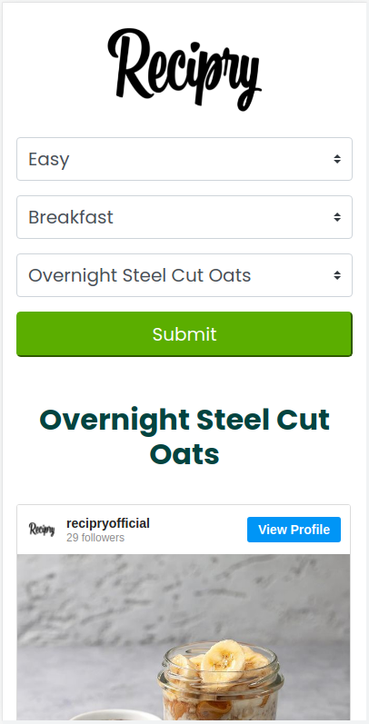
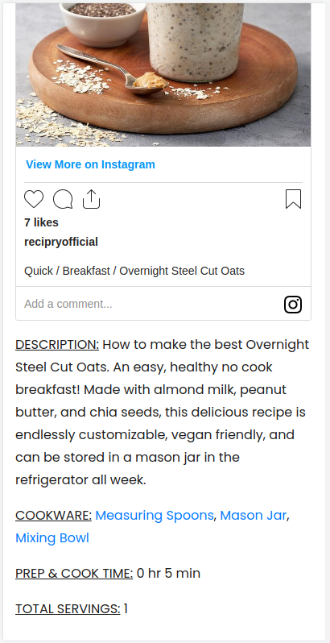
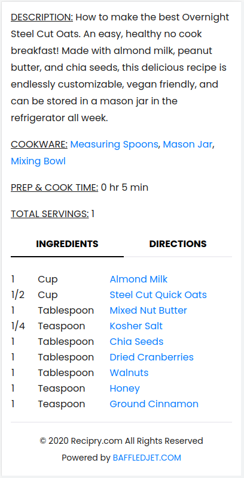
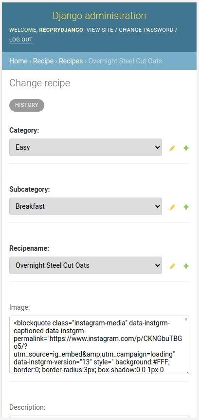
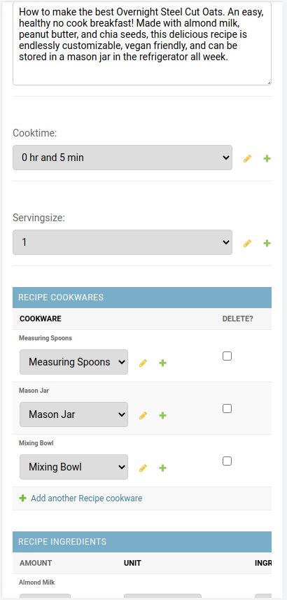
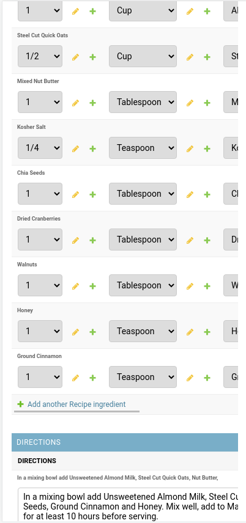
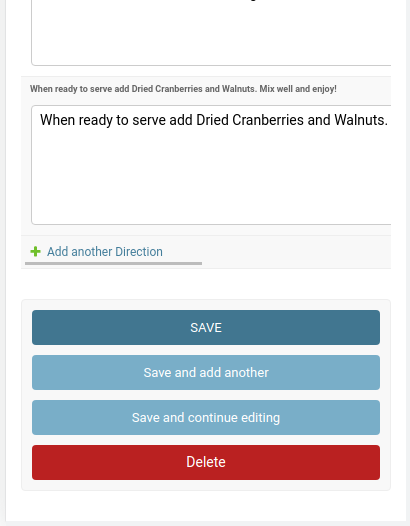

**ABOUT :** RECIPRY (2020) is a web application built with Django Framework that simplifies the cooking process.

**DEMO :** https://www.recipry.com/<br>

**INSTALLATION GUIDE<br>**

Download recipry project and run the following commands inside "recipry-main" directory :<br>

**1. Install Dependecies<br>**
```
sudo apt-get install python3
sudo apt-get install python3-pip
sudo apt-get install python3-venv
```
**2. Run Application<br>**
```
$ source venv/bin/activate
$ python3 manage.py runserver
```
main page : 127.0.0.1:8000<br>
admin     : 127.0.0.1:8000/admin<br>
  
u: recprydjango<br>
p: reciprypass<br>

<hr>

<hr>

<hr>

<hr>

<hr>

<hr>

<hr>

<hr>
